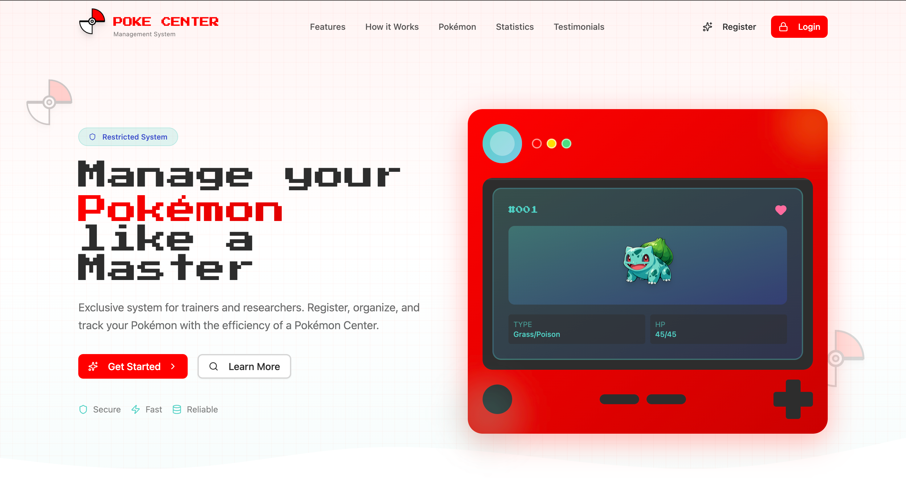
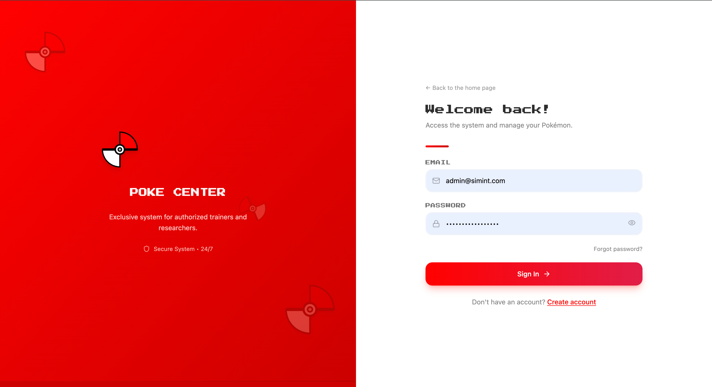
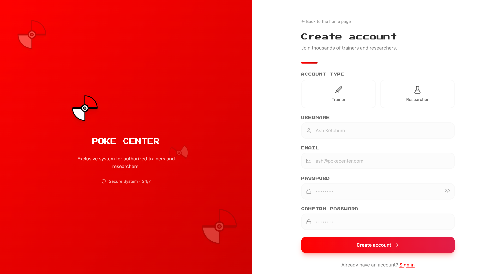
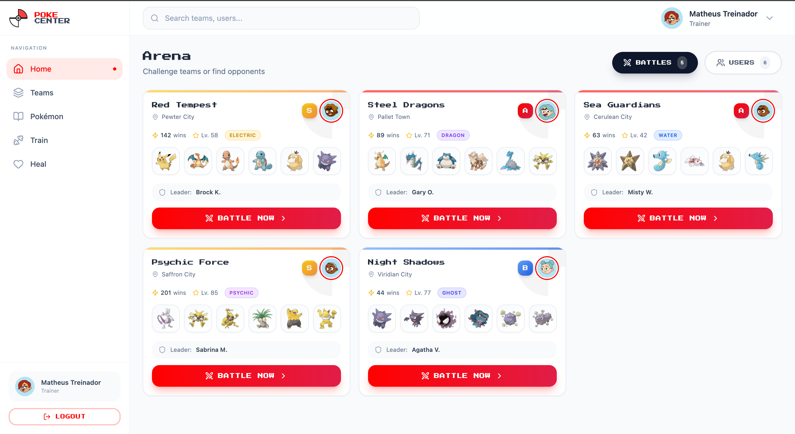
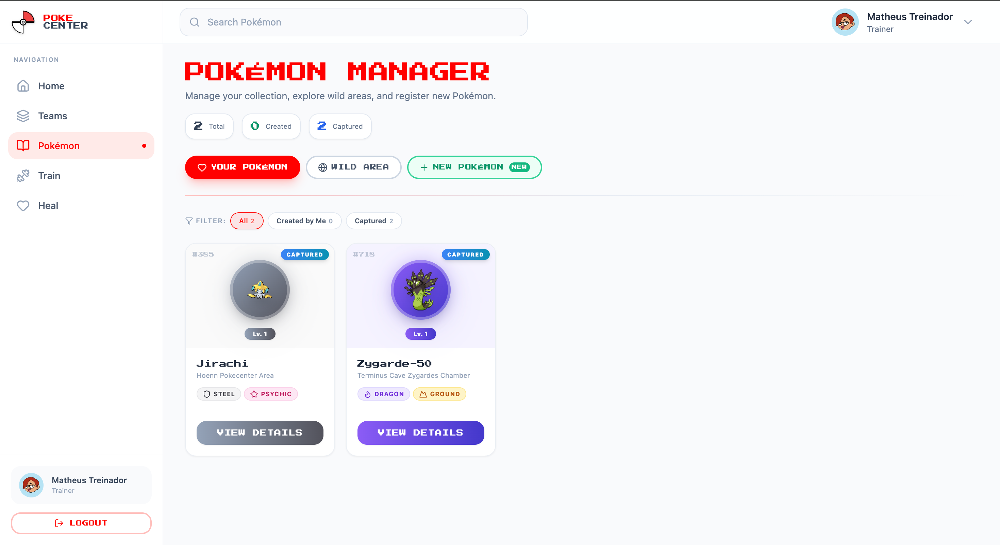
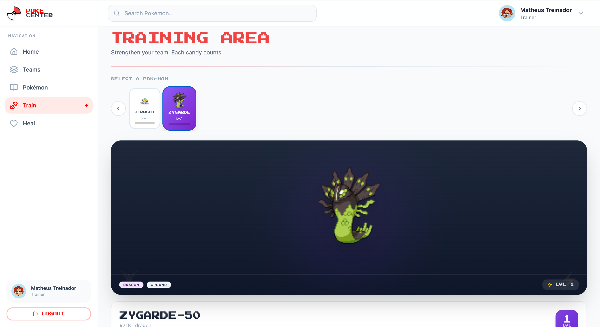
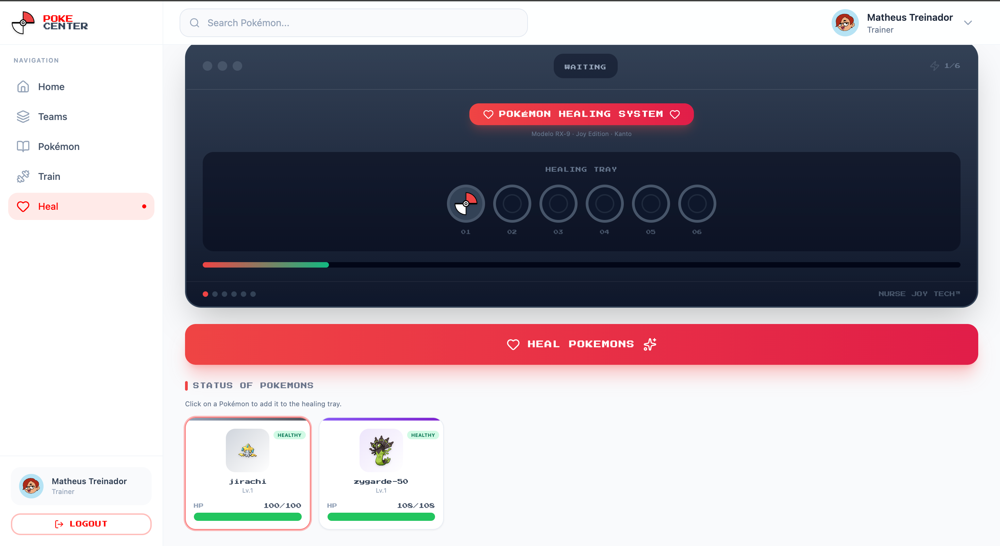
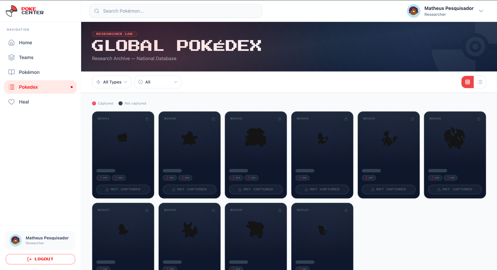

# Poke Center

Sistema exclusivo para treinadores e pesquisadores. Cadastre-se, organize e acompanhe seus Pokémons com a eficiência de um Pokémon Center.

---

## Índice

- [Tecnologias](#tecnologias)
- [Pré-requisitos](#pré-requisitos)
- [Como rodar](#como-rodar)
- [Arquivos e variáveis necessárias](#arquivos-e-variáveis-necessárias)
- [Scripts disponíveis](#scripts-disponíveis)
- [Funcionalidades](#funcionalidades)
- [Permissões por perfil](#permissões-por-perfil)
- [Screenshots](#screenshots)

---

## Tecnologias

- **Next.js 16** (App Router)
- **React 19**
- **TypeScript**
- **Tailwind CSS**
- **Radix UI** (componentes acessíveis)
- **React Hook Form + Zod** (formulários e validação)
- **Recharts** (gráficos)
- **Lucide React** (ícones)

---

## Pré-requisitos

- **Node.js** 20+
- **npm**, **yarn**, **pnpm** ou **bun**
- **Backend da API** rodando (por padrão em `http://localhost:3333`)

---

## Como rodar

### 1. Clonar e instalar dependências

```bash
git clone <url-do-repositorio>
cd simint-challenge-frontend
npm install
```

### 2. Configurar variáveis de ambiente

Crie um arquivo `.env.local` na raiz do projeto (veja [Arquivos e variáveis necessárias](#arquivos-e-variáveis-necessárias)).

### 3. Subir o servidor de desenvolvimento

```bash
npm run dev
```

Acesse [http://localhost:3000](http://localhost:3000). A landing page é exibida em `/`; para área logada, faça login em `/auth/login` ou cadastro em `/auth/register`.

### 4. Build para produção

```bash
npm run build
npm start
```

---

## Arquivos e variáveis necessárias

### Arquivo `.env.local` (opcional)

| Variável | Descrição | Padrão |
|----------|-----------|--------|
| `NEXT_PUBLIC_API_URL` | URL base da API usada no **browser** (fetch direto). Use quando o front e o backend estiverem no mesmo domínio ou CORS estiver ok. | `http://localhost:3333` |
| `BACKEND_URL` | URL do backend usada **apenas no servidor** (roteador de proxy em `/api/proxy/[...path]`). Útil em deploy (ex.: Vercel) para repassar cookies e evitar CORS. | `http://localhost:3333` |

**Exemplo `.env.local`:**

```env
# Desenvolvimento local (backend na mesma máquina)
NEXT_PUBLIC_API_URL=http://localhost:3333
BACKEND_URL=http://localhost:3333
```

Para produção com proxy (ex.: front na Vercel, API na Railway), costuma-se usar:

- `NEXT_PUBLIC_API_URL` apontando para o mesmo domínio do front (para ir para o proxy), ou
- Configurar o front para usar `/api/proxy` como base e definir `BACKEND_URL` com a URL real da API.

**Arquivo de exemplo:** há um `.env.example` na raiz; copie para `.env.local` e ajuste os valores.

---

## Scripts disponíveis

| Comando | Descrição |
|---------|-----------|
| `npm run dev` | Sobe o Next.js em modo desenvolvimento (`http://localhost:3000`). |
| `npm run build` | Gera o build de produção. |
| `npm start` | Sobe o servidor com o build já gerado (rode `npm run build` antes). |
| `npm run lint` | Executa o ESLint no projeto. |

---

## Funcionalidades

### Públicas

- **Landing** (`/`) – Hero, features, como funciona, Pokémons, estatísticas, depoimentos e CTA.
- **Login** (`/auth/login`) – Autenticação por e-mail e senha.
- **Registro** (`/auth/register`) – Cadastro de novo usuário (trainer ou researcher).
- **Time compartilhado** (`/teams/shared/[token]`) – Visualização somente leitura de um time via link compartilhado.

### Área autenticada (por perfil)

- **Dashboard** (`/dashboard`) – Arena: listagem de batalhas disponíveis e de usuários, com abas e busca.
- **Times** (`/teams`) – CRUD de times, listagem com busca/filtro/paginação, detalhe do time e compartilhamento.
- **Pokémon** (`/pokemon`) – Listagem dos Pokémons do usuário com abas e filtros.
- **Detalhe do Pokémon** (`/pokemon/[id]`) – Ver e editar um Pokémon (incluindo sprite/nickname).
- **Pokedex** (`/pokedex`) – Catálogo de Pokémons (acesso **researcher** e **admin**), com filtros e painel de detalhe.
- **Treino** (`/train`) – Treinar Pokémon do time para ganhar XP (acesso **trainer** e **admin**).
- **Cura** (`/healing`) – Máquina de cura para recuperar Pokémons (todos os perfis).
- **Usuários** (`/users`) – Listagem, criação, edição e exclusão de usuários (apenas **admin**), com busca, filtro por role e ordenação.
- **Perfil** (`/profile`) – Editar dados do usuário logado (username, email, senha e, se admin, role).

Layout da área logada: **sidebar** (navegação por permissão), **header** com busca (quando a página usa) e menu do usuário (avatar, “Editar meus dados”, logout).

---

## Permissões por perfil

| Rota | Admin | Trainer | Researcher |
|------|-------|---------|------------|
| Dashboard | ✅ | ✅ | ✅ |
| Times | ✅ | ✅ | ✅ |
| Pokémon | ✅ | ✅ | ✅ |
| Pokedex | ✅ | ❌ | ✅ |
| Treino | ✅ | ✅ | ❌ |
| Cura | ✅ | ✅ | ✅ |
| Usuários | ✅ | ❌ | ❌ |
| Perfil | ✅ | ✅ | ✅ |

Acesso é validado no layout protegido; rotas não permitidas redirecionam para o dashboard.

---

## Screenshots

Principais funcionalidades da aplicação em uso. As imagens estão em `docs/screenshots/`.

### Landing

Primeira dobra da landing: hero com título, badge "Restricted System" e CTA.



---

### Autenticação

**Login** (`/auth/login`) — Acesso com e-mail e senha.



**Registro** (`/auth/register`) — Cadastro com escolha de tipo de conta (Treinador ou Pesquisador).



---

### Área logada — por perfil

A sidebar e as rotas mudam conforme o perfil (Trainer, Researcher). As telas abaixo ilustram as duas roles principais.

#### Dashboard (Arena)



#### Times

Lista de times do usuário: busca, filtros (All / Public / Private), botão "Create new team" e cards de times.


#### Pokémon

Gerenciador de Pokémons: abas *Your Pokémon*, *Wild Area*, *New Pokémon*, filtros (All / Created by Me / Captured) e busca.



#### Treino (Trainer)

Área de treino para ganhar XP; exibida apenas para **Trainer**. Estado vazio quando não há Pokémon para treinar.



#### Cura (Healing)

Máquina de cura para recuperar HP dos Pokémons; disponível para todos os perfis. Bandeja de cura e status dos Pokémons.



#### Pokedex (Researcher)

Catálogo global: filtro por tipo, filtro Captured/Not captured, visualização em grade ou lista e paginação. Acesso **Researcher** (não aparece para Trainer).



---

## Deploy

O projeto está preparado para deploy em plataformas como **Vercel**. Configure as variáveis de ambiente no painel e, se a API estiver em outro domínio, use o proxy (`BACKEND_URL`) para repassar requisições e cookies. Consulte a [documentação de deploy do Next.js](https://nextjs.org/docs/app/building-your-application/deploying).
